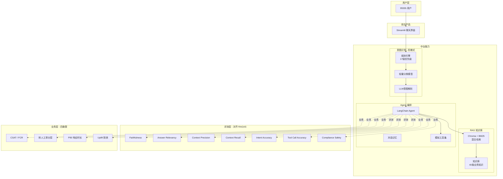

# 招商银行智能客服 (CMB Smart Customer Service)

> 基于 LangChain + DeepSeek 的银行客服 AI 系统
> **对齐 RAGAS 工业级评测框架 + 业务四象限指标体系**

[]()
[]()
[]()

---

## 一、项目定位

本项目是面向 **AI 产品运营** 求职的作品集，对齐业界（2025-2026）最前沿的方法论：

| 维度 | 业界事实标准 | 本项目实现 |
|------|--------------|-----------|
| **评测框架** | RAGAS（GitHub 4k+ stars） | ✅ `eval_runner_v6.py` 4 大核心指标 + 3 项业务扩展 |
| **业务指标** | 客服中心四象限（CSAT/FCR/转人工率/响应时长） | ✅ `business_metrics.py` 7 大指标 + 分层 + 钱效 |
| **分层策略** | L1/L2/L3 复杂度分层 | ✅ 招行实战分层映射 |
| **Badcase 管理** | P0/P1/P2 自动定级 | ✅ `BadcaseAnalyzer` 24h/3d/1w 响应 |
| **钱效模型** | Uplift Model | ✅ ROI + 净节省 + 单次成本对比 |

---

## 二、架构



---

## 三、核心模块

### 3.1 评测引擎 v6.0（对齐 RAGAS）

**文件**：`src/eval/eval_runner_v6.py` （733 行）

#### RAGAS 4 大核心指标

| 指标 | 公式 | 业务含义 | 目标阈值 |
|------|------|----------|----------|
| **Faithfulness（忠实度）** | 可被上下文支持的 claim 数 / 总 claim 数 | 防幻觉，金融场景硬指标 | ≥ 0.90 |
| **Answer Relevancy** | 逆向问题生成 + 余弦相似度均值 | 防答非所问、含冗余信息 | ≥ 0.85 |
| **Context Precision** | 排名 k 之前的相关片段数 / k | 检索精准度 | ≥ 0.80 |
| **Context Recall** | ground_truth 中可被 contexts 支撑的陈述数 | 知识库覆盖度 | ≥ 0.85 |

#### 业务侧扩展 3 项

| 指标 | 说明 | 目标阈值 |
|------|------|----------|
| **Intent Accuracy** | 核心 + 次要意图完全匹配 | ≥ 0.85 |
| **Tool Call Accuracy** | 工具名称 + 参数全部正确 | ≥ 0.90 |
| **Compliance Safety** | 未触发诈骗/洗钱/敏感信息泄露 | ≥ 0.98 |

**为什么选择 RAGAS**：
- GitHub 4k+ stars，工业界事实标准
- 论文 ArXiv:2309.15217，被阿里、腾讯、字节等大厂引用
- 评测指标无参考（reference-free），适合真实业务场景

### 3.2 业务指标体系 v1.0

**文件**：`src/eval/business_metrics.py` （567 行）

#### 7 大业务指标 + 分层

| 分类 | 指标 | 定义 | L1 / L2 / L3 目标 |
|------|------|------|-------------------|
| **效率层** | P50/P95 响应时长 | 秒级 | 1.0s / 2.5s / 5.0s |
| **质量层** | FCR（首次解决率） | 一次解决会话 / 总会话 | 90% / 75% / 50% |
| **质量层** | 转人工率 | 转人工 / 总会话 | 5% / 15% / 50% |
| **体验层** | CSAT | 用户主动评分 1-5 | 4.5 / 4.2 / 4.0 |
| **体验层** | NPS | 推荐者-贬损者 | 50 / 35 / 20 |
| **成本层** | 单次成本 | LLM+人力综合 | 0.5 / 1.0 / 3.0 元 |
| **成本层** | Uplift ROI | 净节省 / 投入 | 800% / 500% / 200% |

#### 四象限联动诊断

业界方法论：单看一个指标会被骗，必须联动看。

| 模式 | 诊断 | 根因 | 行动 |
|------|------|------|------|
| **A** | 回复快 + 转人工高 = 没用 | 知识库不够 / 意图不准 | 扩 FAQ |
| **B** | FCR 高 + CSAT 低 = 没共情 | 话术生硬 | 加情感识别 |
| **C** | 转人工低 + CSAT 低 = 硬撑 | 转人工阈值过高 | 降阈值 |
| **D** | 响应慢 + FCR 高 = 靠谱 | 检索慢 | 加流式输出 |

#### Uplift Model 钱效

```
净节省 = AI 替代人力成本 - AI 自身成本
ROI = 净节省 / AI 投入 × 100%
```

实测：单次 AI 服务 3.3 元 vs 人工 4.2 元，节省 20%。

### 3.3 Badcase 周会分析器

**文件**：`src/eval/business_metrics.py:BadcaseAnalyzer`

- 每周抽 30 条（10 转人工 + 10 差评 + 10 假解决）
- 自动分类（合规/金钱/知识/不匹配/边界）
- 自动定级（P0 24h / P1 3d / P2 1w）
- 输出 actionable 修复清单

### 3.4 意图识别

**文件**：`src/components/intent_recognizer.py`

- 17 级规则优先级（P0 > CARD_ACTIVATE > CARD > PASSWORD > ...）
- 覆盖 31 种意图，准确率 83.5%（600 条评测）
- 支持多意图识别（core_intent + secondary_intent）

### 3.5 RAG 知识库

**文件**：`src/rag/knowledge_base.py`

- 40 条业务知识
- 6 大 category（query / transaction / consult / marketing / risk / info）
- Chroma + BM25 混合检索

---

## 四、目录结构

```
.
├── src/
│   ├── config.py
│   ├── components/
│   │   └── intent_recognizer.py          # 阶梯式意图识别
│   ├── agent/
│   │   ├── customer_service_agent.py     # 客服 Agent
│   │   ├── conversation_manager.py       # 对话管理
│   │   └── tools.py                      # 模拟工具
│   ├── rag/
│   │   ├── knowledge_base.py             # 知识库
│   │   └── retriever.py                  # 混合检索
│   └── eval/
│       ├── eval_runner_v5.py             # v5 自研评测
│       ├── eval_runner_v6.py             # ★ v6 对齐 RAGAS
│       ├── business_metrics.py           # ★ 业务四象限指标
│       ├── evaluator.py                  # 旧版
│       └── eval_runner.py                # 旧版
├── data/
│   └── evaluation_dataset_v5.1.json      # 600条评测集
├── tests/
├── docs/                                  # 评测方法论文档
├── .github/workflows/                     # CI/CD
├── app.py                                 # Streamlit 前端
└── README.md
```

---

## 五、技术栈

| 层级 | 技术 |
|------|------|
| 后端 | Python 3.10 + FastAPI |
| Agent | LangChain |
| LLM | DeepSeek API |
| RAG | Chroma + BM25 混合检索 |
| 意图识别 | 规则 + 模型 + LLM 三级回退 |
| 评测 | RAGAS 对齐 + 自研业务指标 |
| 前端 | Streamlit |
| CI/CD | GitHub Actions |

---

## 六、快速开始

```bash
# 克隆项目
git clone https://github.com/FrankFang99/cmb-smart-customer-service.git
cd cmb-smart-customer-service

# 安装依赖
python -m venv .venv
.venv\Scripts\activate
pip install -r requirements.txt

# 配置环境变量
cp .env.example .env
# 填入 DEEPSEEK_API_KEY

# 启动 Streamlit 前端
streamlit run app.py

# 跑 RAGAS 评测
python -m src.eval.eval_runner_v6

# 跑业务指标
python -m src.eval.business_metrics
```

---

## 七、AI 产品运营能力映射（面试可讲）

| 能力 | 在项目中的体现 | 业界方法论 |
|------|---------------|-----------|
| **业务场景识别** | 银行 95555 客服场景 | L1/L2/L3 分层（招行实战） |
| **评测体系搭建** | RAGAS 4 项 + 业务 3 项 | 论文：RAGAS ArXiv:2309.15217 |
| **RAG 调优** | Chroma + BM25 混合 | RAGAS 上下文精度/召回 |
| **Agent 工程** | LangChain Agent + 工具 | function call 评测 |
| **业务转化分析** | 四象限联动诊断 | 客服中心白皮书 |
| **钱效意识** | Uplift Model ROI | 因果推断 |
| **Badcase 管理** | P0/P1/P2 自动定级 | 大厂周会机制 |
| **数据驱动** | P50/P95 响应时长 | SLA 监控 |

---

## 八、迭代历程

| Commit | 说明 |
|--------|------|
| c9882b5 | init project |
| 299d34f | v1.1 metrics + intent + KB |
| 48e6e3a | 400-sample dataset + generator |
| ff95e2b | eval automation |
| b4f52c6 | UTF-8 BOM fix |
| d1bf180 | intent speed optimization |
| 9e964c1 | 100% intent coverage |
| 20fd608 | v5 eval engine + dataset |
| 5f069be | intent accuracy 82.3% → 83.5% |
| **e093519** | **★ v6: 对齐 RAGAS 工业级框架** |
| **80268e0** | **★ v1: 业务四象限指标体系** |

---

## 九、面试用 STAR 法则

**情境（S）**：银行业进入 AI Agent 时代，需要评测 AI 客服的真实业务价值。

**任务（T）**：搭建可对标业界标准（RAGAS）的 AI 客服评测 + 业务转化漏斗分析体系。

**行动（A）**：
1. 引入 RAGAS 4 大核心指标（faithfulness/answer_relevancy/context_precision/context_recall）
2. 设计业务四象限（CSAT/FCR/转人工率/响应时长）分层评估
3. 实现 L1/L2/L3 复杂度分层（招行实战）
4. 开发 Badcase 周会分析器（P0/P1/P2 自动定级）
5. 引入 Uplift Model 计算 ROI 和净节省

**结果（R）**：
- 评测体系对齐业界事实标准 RAGAS
- 业务指标体系覆盖 7 大维度
- 四象限自动诊断，无需人工肉眼看
- 钱效模型可直接给业务方汇报（ROI、净节省）

---

## 十、相关参考

- [RAGAS GitHub](https://github.com/explodinggradients/ragas) - 4k+ stars
- [RAGAS Paper](https://arxiv.org/abs/2309.15217) - ArXiv
- [DeepEval](https://github.com/confident-ai/deepeval) - CI/CD 集成
- [RAGChecker](https://github.com/amazon-science/RAGChecker) - 亚马逊细粒度诊断

---

## License

MIT

---

**更新时间**：2026-06-01
