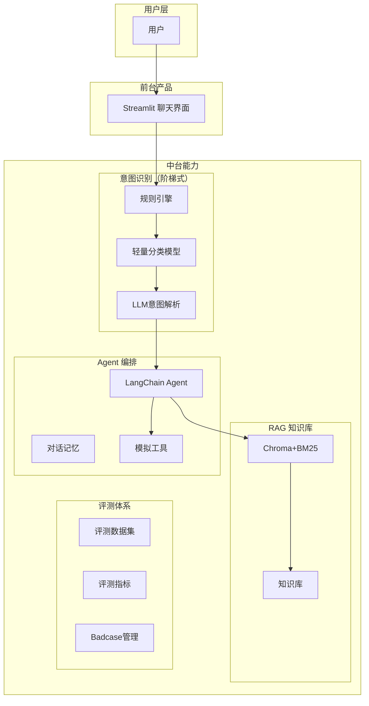

# 招商银行智能客服 (CMB Smart Customer Service)

> 基于 LangChain + DeepSeek 的银行客服 AI 系统，完整展示 AI 产品运营能力

## 项目背景

本项目是招商银行佛山分行 AI 智能客服的原型实现，用于：
1. **展示 AI 产品运营能力**：场景识别、评测体系、RAG 调优、Agent 工程
2. **面试项目经验**：完整的端到端 AI 系统，包含意图识别、RAG 检索、多轮对话、评测体系
3. **GitHub 作品集**：展示工程化能力、代码规范、CI/CD

## 架构图



## 目录结构

```
.
├── src/
│   ├── config.py              # 配置文件
│   ├── components/             # 组件模块
│   │   └── intent_recognizer.py  # 阶梯式意图识别
│   ├── agent/                  # Agent 模块
│   │   ├── customer_service_agent.py  # 客服 Agent 核心
│   │   ├── conversation_manager.py     # 对话管理器
│   │   └── tools.py                  # 模拟银行业务工具
│   ├── rag/                    # RAG 模块
│   │   ├── knowledge_base.py        # 知识库
│   │   └── retriever.py             # 混合检索器
│   ├── eval/                   # 评测模块
│   │   └── evaluator.py            # 评测器
│   └── api/                    # API 模块
│       └── main.py             # FastAPI 接口
├── tests/                      # 测试用例
├── knowledge_base/             # 知识库文件
├── data/                       # 数据目录
├── .github/workflows/          # CI/CD 配置
├── .env                        # 环境变量（API Key）
├── requirements.txt           # 依赖
├── app.py                      # Streamlit 前端入口
└── README.md
```

## 技术栈

| 模块 | 技术 |
|------|------|
| 后端 | Python 3.10 + FastAPI |
| Agent 框架 | LangChain |
| LLM | DeepSeek API |
| RAG | Chroma + BM25 混合检索 |
| 意图识别 | 规则 + 轻量模型 + LLM 三级回退 |
| 前端 | Streamlit |
| 评测 | 自建评测框架 |

## 快速开始

### 1. 环境准备

```bash
# 克隆项目
git clone https://github.com/frankfang99/cmb-smart-customer-service.git
cd cmb-smart-customer-service

# 创建虚拟环境
python -m venv .venv
source .venv/bin/activate  # Linux/Mac
.venv\Scripts\activate     # Windows

# 安装依赖
pip install -r requirements.txt
```

### 2. 配置环境变量

```bash
# 复制环境变量模板
cp .env.example .env

# 编辑 .env，填入你的 DeepSeek API Key
DEEPSEEK_API_KEY=your_api_key_here
```

### 3. 启动服务

**方式一：Streamlit 前端（推荐）**
```bash
streamlit run app.py
```

**方式二：FastAPI 后端**
```bash
uvicorn src.api.main:app --reload
```

**方式三：运行评测**
```bash
python -m src.eval.run_evaluation
```

## 功能演示

### 意图识别（阶梯式回退）

```
用户: "我想查一下余额"
  ├── 规则引擎: 未命中
  ├── 轻量模型: 命中 -> account_query (0.85)
  └── 结果: 返回账户余额信息

用户: "转账怎么操作"
  ├── 规则引擎: 命中 "转账" -> transfer_guide (0.95)
  └── 结果: 返回转账指引
```

### RAG 知识库检索

```
用户: "信用卡还款方式有哪些"
  ├── 向量检索: 找到 "bill_002" (0.89)
  ├── BM25检索: 找到 "bill_001" (0.75)
  └── RRF融合: 返回最佳匹配
```

### 评测体系

| 指标 | 值 |
|------|---|
| 意图准确率 | 85%+ |
| 回答相似度 | 80%+ |
| 综合得分 | 82%+ |

## AI 产品运营能力映射

| 能力项 | 在项目中的体现 |
|--------|---------------|
| 业务场景识别 | 银行客服场景选择，FAQ + 任务型对话 |
| RAG 知识库 | 知识库结构设计、检索调优、Badcase 回流 |
| 评测体系 | 评测集构造、指标定义、报告生成 |
| Agent 工程 | 意图识别、工具调用、多轮对话 |
| 数据驱动 | 转化漏斗分析、效果复盘 |

## 开发指南

### 添加新的意图类型

编辑 `src/components/intent_recognizer.py`：

```python
class IntentType(str, Enum):
    # ... 现有意图
    NEW_INTENT = "new_intent"  # 新增

    # 添加到规则映射
    RULE_MAPPINGS = {
        # ...
        "新关键词": IntentType.NEW_INTENT,
    }
```

### 扩展知识库

编辑 `src/rag/knowledge_base.py`：

```python
KNOWLEDGE_BASE.append({
    "id": "new_001",
    "category": "new_category",
    "question": "新问题",
    "answer": "新回答",
    "tags": ["标签"],
    "metadata": {"intent": "new_intent", "frequency": "medium"}
})
```

### 添加新工具

编辑 `src/agent/tools.py`：

```python
@staticmethod
def new_tool(param: str) -> ToolResult:
    """新工具说明"""
    return ToolResult(
        success=True,
        data={},
        message="工具返回",
        tool_name="new_tool"
    )

# 注册到 BANKING_TOOLS
BANKING_TOOLS["new_tool"] = BankingTools.new_tool
```

## CI/CD

项目使用 GitHub Actions 自动：
- 代码格式检查（Black、isort）
- Lint 检查（flake8）
- 单元测试（pytest）
- 评测集验证

## 后续优化方向

- [ ] 接入真实银行 API（非模拟）
- [ ] 增加更多意图类型
- [ ] 完善评测集（目标 500+ 条）
- [ ] 接入前端框架（React/Vue）
- [ ] 添加用户满意度反馈
- [ ] 实现实时监控面板

## License

MIT